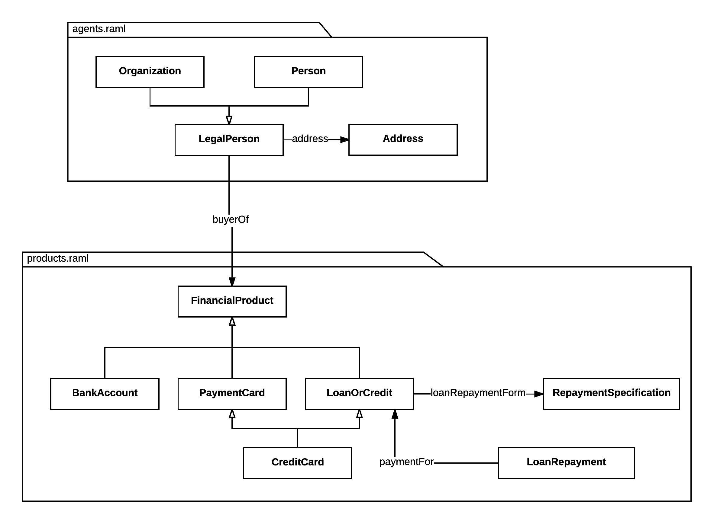
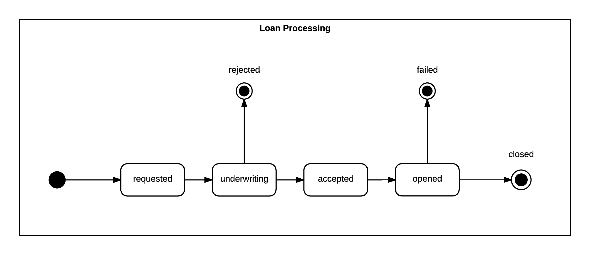
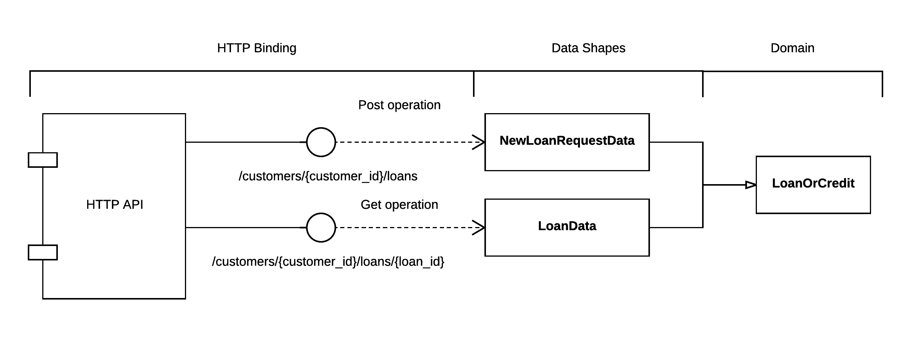

# Banking Example

Modelling of an example application domain and APIs using RAML and AMF

The core of this description is valid HTTP RAML API.
Different extensions to show how the domain model can be specified and re-used in different kind of APIs have been added as valid RAML 1.0 annotations.
If your interest is current RAML 1.0 HTTP APIs these annotations can be ignored.

## Domain

The domain of the application is a subset of the financial domain. It involves two main use cases:

- Common financial products and customers
- Loan repayment underwriting and processing

Most of the domain has been adopted from Financial Industry Business Ontology (FIBO).

The main entities in the domain are shown in the following diagram:

The loan underwriting and repayment process is shown in the following diagram:

The domain description can be found in the `domain` folder as a set of RAML documents using the `extensions/domain.raml` annotations

## HTTP API

The HTTP API can be found in the `http/api.raml` document. It introduces a number of data shapes described in `http/dataTypes/shapes.raml`.
An example of how the domain is bound to the HTTP API is shown in the following diagram:

## Out of band hypermedia links

In the description of the APIs is useful to be able to specify hypermedia links. For example links between two resources in RAML might instantiate a relationship between two entities in the domain model. This relationship is implicit in the RAML API nesting structure. The extension `extensions/hypermedia.raml` provides a mechanism to relate these implicit links to the domain model relationships and how to use these relationships as URL templates.
A mechanism to relate endpoints between different resources as out of bound link templates has also been introduced.
